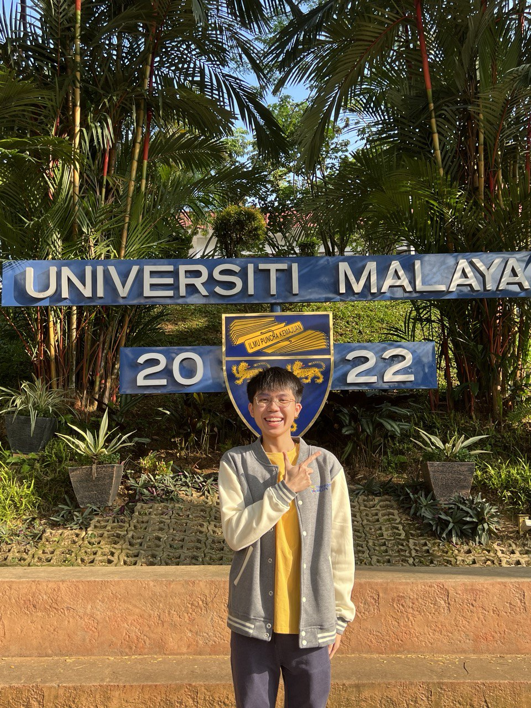

  
Hi! I'm Cheong Jin Xuan, a student in the Software Maintenance and Evolution course.
I expect to learn a lot about modern software maintenance practices and how to work with legacy systems.

You can view my personalized GitHub profile
[here](https://github.com/MoneyCheongJx).

